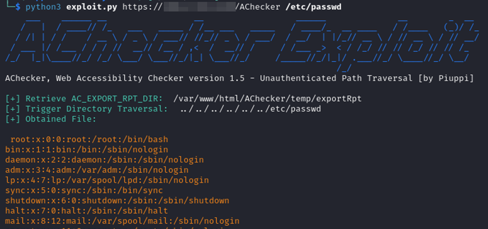
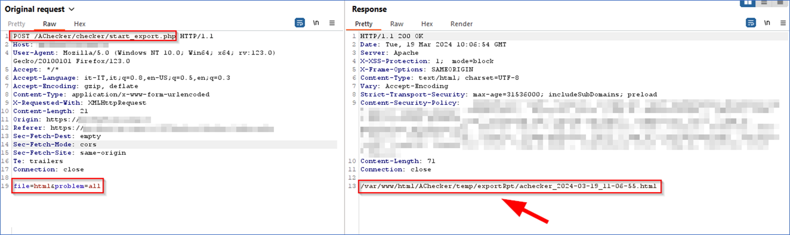
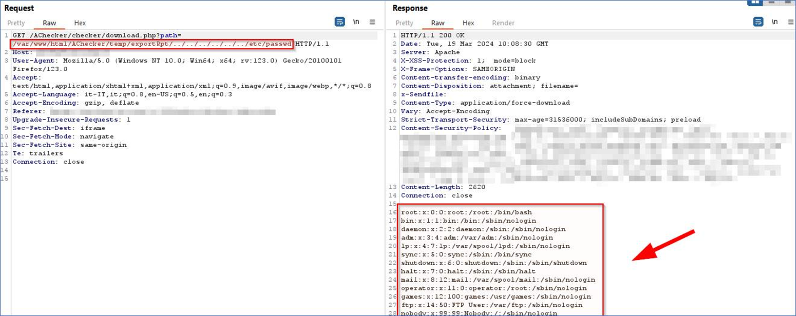
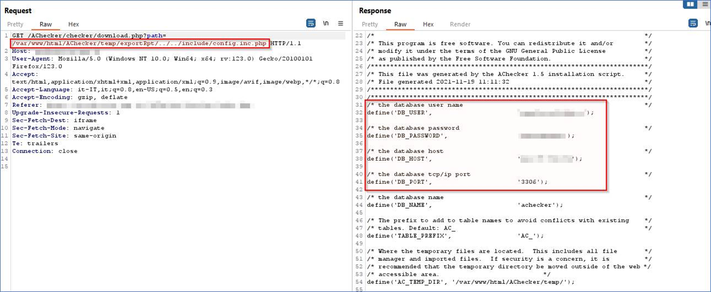

# [CVE-2024-34523](https://cve.mitre.org/cgi-bin/cvename.cgi?name=CVE-2024-34523): AChecker 1.5 Unauthenticated Path Traversal

### Overview
AChecker (https://github.com/inclusive-design/AChecker) is an automated Web Accessibility Checker tool developed by the Inclusive Design Institute. It is used to evaluate the accessibility of HTML pages and ensure they can be accessed by all individuals, including those with disabilities who use assistive technologies to navigate the Internet.

### Vulnerability Description
[CVE-2024-34523](https://cve.mitre.org/cgi-bin/cvename.cgi?name=CVE-2024-34523) - AChecker 1.5 allows remote attackers to read the contents of arbitrary files via the download.php 'path' parameter by using Unauthenticated Path Traversal. This occurs through readfile in PHP.
  ***NOTE**: This vulnerability only affects products that are no longer supported by the maintainer.*

### Impact
An attacker could access sensitive files or directories on the server that they should not have access to, such as configuration files, sensitive or confidential data, and source code. 
Path traversal can also be exploited as a means to launch a DoS attack by requesting a large number of files or server resources, consuming resources and potentially causing a system overload or denial of service to legitimate users.

### Timeline
- **2024-03-19**: Discovered and reported to IDRC Security Team at https://github.com/inclusive-design/idrc/security 
- **2024-03-20**: Remote server returned '550 5.4.300 Message expired -> 454 4.7.1 <security@lists.idrc.ocad.ca>: Relay access denied'
- **2024-03-21**: I attempted to contact some historical contributors to the project regarding this vulnerability. They thanked me for my effort in tracking down the upstream supporter but informed me that the AChecker project has been discontinued and its repository archived. Therefore, for self-hosted AChecker instances, maintenance and bug fixes are the responsibility of the individuals hosting the instance.
- **2024-03-25**: I requested the CVE-ID from MITRE
- **2024-05-05**: MITRE has assigned the [CVE-2024-34523](https://cve.mitre.org/cgi-bin/cvename.cgi?name=CVE-2024-34523)
- **2024-05-06**: I have released the PoC for CVE publication

### Discovered by
#### [Gianluca Palma](https://www.linkedin.com/in/piuppi/) ([@piuppi](https://twitter.com/piuppi)) of [Engineering Ingegneria Informatica S.p.A.](https://www.eng.it)

### Proof of Concept (PoC)

#### Reproducing Steps

***NOTE**: This vulnerability was identified during a recent engagement for one of our customers who was hosting a self-hosted AChecker instance on the Internet.*

##### 1. First, you need to identify the absolute path to the web server with this POST request:

##### 2. Once the absolute path is obtained, the contents of arbitrary files can be retrieved with this GET request:

##### 3. The following is an example payload to retrieve the application's config.inc.php file that, in our environment, allowed us lateral movement on the backend database:

### Prevention

A possible algorithm for preventing directory traversal would be to:

- Process URI requests that do not result in a file request, e.g., executing a hook into user code, before continuing below.
- When a URI request for a file/directory is to be made, build a full path to the file/directory if it exists, and normalize all characters (e.g., %20 converted to spaces).
- It is assumed that a 'Document Root' fully qualified, normalized, path is known, and this string has a length N. Assume that no files outside this directory can be served.
- Ensure that the first N characters of the fully qualified path to the requested file is exactly the same as the 'Document Root'.
- If so, allow the file to be returned.
- If not, return an error, since the request is clearly out of bounds from what the web-server should be allowed to serve.
- Check if the string contains '..' (two periods next to each other).
- Using a hard-coded predefined file extension to suffix the path does not limit the scope of the attack to files of that file extension.
