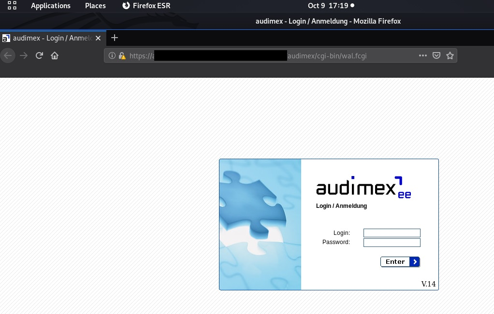
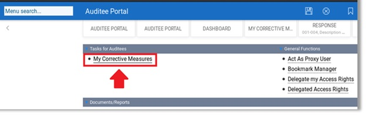
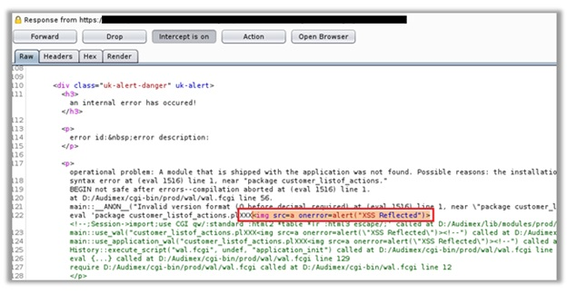
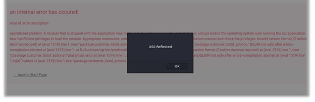

# Reflected XSS (Cross-Site-Scripting) in AudimexEE ver 14.1.0 (https://www.web-audimex.com)

### Overview

AudimexEE is an audit software solution for large enterprises that fulfils highest demands in terms of the implementation of auditing processes and corporate structures surrounding a powerful and highly flexible audit universe.

#### Before **14.1.1** version is vulnerable to Reflected XSS (Cross-Site-Scripting)*, allows remote attackers to inject arbitrary web script or HTML via '**action, cargo and panel**' parameters, that can lead in data leakage.

### Description
Reflected cross-site scripting vulnerabilities arise when data is copied from a request and echoed into the application's immediate response in an unsafe way. The vulnerability is resent in the wal.fcgi, can be exploited* via via POST request on '**action, cargo and panel**' parameters, using a payload for trigger the  HTML Tag. However it was possible to convert the request to use the GET method. 
  
#### * Important Note: the XSS does not occur when setting the recommended security configuration parameter "**unique_error_numbers**".

### Impact
An attacker can use the vulnerability to construct a request that, if issued by another application user, will cause JavaScript code supplied by the attacker to execute within the user's browser in the context of that user's session with the application.
The attacker-supplied code can perform a wide variety of actions, such as performing arbitrary actions on the victim's behalf, and logging their keystrokes.
Users can be induced to issue the attacker's crafted request in various ways. For example, the attacker can send a victim a link containing a malicious URL in an email or instant message.

### Timeline
- 2020-10-09: Discovered and reported to Audimex
- 2020-10-09: Got instant response from Audimex development team, "Thanks for your analysis report. We will evaluate your finding and get back to you soon with our feedback."
- 2020-10-12: Audimex fixed this issue in audimexEE version 14.1.1
- 2020-10-26: First public PoC and requested CVE ID to MITRE

### Discovered by

#### [Gianluca Palma](https://www.linkedin.com/in/piuppi/) from [Engineering Ingegneria Informatica S.p.A.](https://www.eng.it)

### Proof of concept (POC)
#### Reproducing Steps

After authenticating on the **AudimexEE v.14** portal with an **'any'** profile,

I have identified an **Reflected XSS (Cross-Site-Scripting)** in the main section of the site wal.fcgi

All request on contextual menus that contain references to this parameters are vulnerable to HTML/javascript code injection.
This flaw triggers an application error that does not properly sanitize HTML/Javascript tags, below the evidence.

##### Request:

##### Response:

##### Render page:

### Suggestions

In most situations where user-controllable data is copied into application responses, cross-site scripting attacks can be prevented using two layers of defenses:
- Input should be validated as strictly as possible on arrival, given the kind of content that it is expected to contain. For example, personal names should consist of alphabetical and a small range of typographical characters, and be relatively short; a year of birth should consist of exactly four numerals; email addresses should match a well-defined regular expression. Input which fails the validation should be rejected, not sanitized.
- User input should be HTML-encoded at any point where it is copied into application responses. All HTML metacharacters, including < > " ' and =, should be replaced with the corresponding HTML entities (&lt; &gt; etc).
In cases where the application's functionality allows users to author content using a restricted subset of HTML tags and attributes (for example, blog comments which allow limited formatting and linking), it is necessary to parse the supplied HTML to validate that it does not use any dangerous syntax; this is a non-trivial task.

