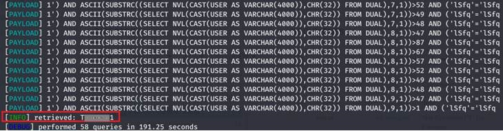

# CVE-2020-28115: SQL Injection vulnerability in "Documents component" found in AudimexEE version 14.1.0 allows an attacker to execute arbitrary SQL commands via the object_path parameter.

### Overview
AudimexEE ([https://www.web-audimex.com/audimexee](https://www.web-audimex.com/audimexee)) is an audit software solution for large enterprises that fulfils highest demands in terms of the implementation of auditing processes and corporate structures surrounding a powerful and highly flexible audit universe.

### Description
The SQLi vulnerability, in the Documents component, can be exploited via '**object_path**' parameter, using a payload to trigger an 'error-based' or 'boolean-based blind' SQL injection.

### Impact
This vulnerability allows attackers with limited privileges to execute arbitrary SQL commands on the database server.

### Timeline
- **2020-10-09**: Discovered and reported to [Audimex](https://www.web-audimex.com)
- **2020-10-09**: Got instant response from Audimex development team, "Thanks for your analysis report. We will evaluate your finding and get back to you soon with our feedback."
- **2020-10-12**: Audimex fixed this issue in audimexEE version 14.1.1
- **2020-11-05**: I have obtained the [CVE-2020-28115](https://nvd.nist.gov/vuln/detail/CVE-2020-28115) and published the PoC

### Discovered by

#### [Gianluca Palma](https://www.linkedin.com/in/piuppi/) ([@piuppi](https://twitter.com/piuppi)) of [Engineering Ingegneria Informatica S.p.A.](https://www.eng.it)

### Proof of concept (POC)
#### Reproducing Steps

After authenticating on the **AudimexEE v.14** portal with an **'auditor'** profile,

I have identified an **Error-Based SQL Injection** in the search filters of the **"Documents"** section 

Sending the filter search form generates a POST request in which the **"object_path"** parameter is not properly sanitized and allows SQL code to be embedded into the query.
By breaking the query, you can see the Oracle error type **ORA-01756** and view the entire query issued to the backend, below the evidence.

##### Request:

##### Response:

 
After several attempts a valid payload was identified to exfiltrate the information from the database.
The SQLi payload, for the error-based techinque, is the following: "**AND error-based - WHERE or HAVING clause (DBMS_UTILITY.SQLID_TO_SQLHASH)**", but boolean blind payloads are fine too (if security configuration parameter 'unique_error_numbers' is set), below the evidence.

##### Oracle Banner:

##### Available databases:

 

##### Tables Preview

##### Boolean Blind Payload (current user)

### Suggestions

The most effective way to prevent SQL injection attacks is to use parameterized queries (also known as prepared statements) for all database access. This method uses two steps to incorporate potentially tainted data into SQL queries: first, the application specifies the structure of the query, leaving placeholders for each item of user input; second, the application specifies the contents of each placeholder. Because the structure of the query has already been defined in the first step, it is not possible for malformed data in the second step to interfere with the query structure. You should review the documentation for your database and application platform to determine the appropriate APIs which you can use to perform parameterized queries. It is strongly recommended that you parameterize every variable data item that is incorporated into database queries, even if it is not obviously tainted, to prevent oversights occurring and avoid vulnerabilities being introduced by changes elsewhere within the code base of the application.

You should be aware that some commonly employed and recommended mitigations for SQL injection vulnerabilities are not always effective:

- One common defense is to double up any single quotation marks appearing within user input before incorporating that input into a SQL query. This defense is designed to prevent malformed data from terminating the string into which it is inserted. However, if the data being incorporated into queries is numeric, then the defense may fail, because numeric data may not be encapsulated within quotes, in which case only a space is required to break out of the data context and interfere with the query. Further, in second-order SQL injection attacks, data that has been safely escaped when initially inserted into the database is subsequently read from the database and then passed back to it again. Quotation marks that have been doubled up initially will return to their original form when the data is reused, allowing the defense to be bypassed.

- Another often cited defense is to use stored procedures for database access. While stored procedures can provide security benefits, they are not guaranteed to prevent SQL injection attacks. The same kinds of vulnerabilities that arise within standard dynamic SQL queries can arise if any SQL is dynamically constructed within stored procedures. Further, even if the procedure is sound, SQL injection can arise if the procedure is invoked in an unsafe manner using user-controllable data.

