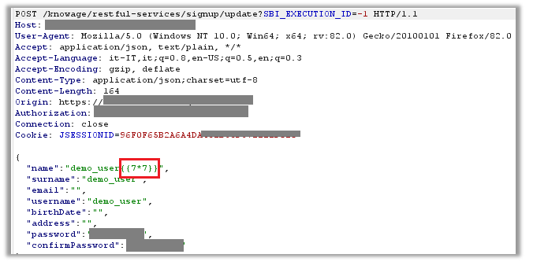
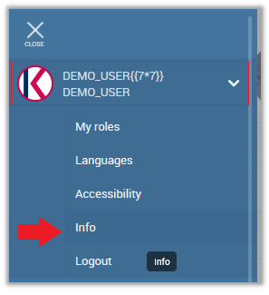
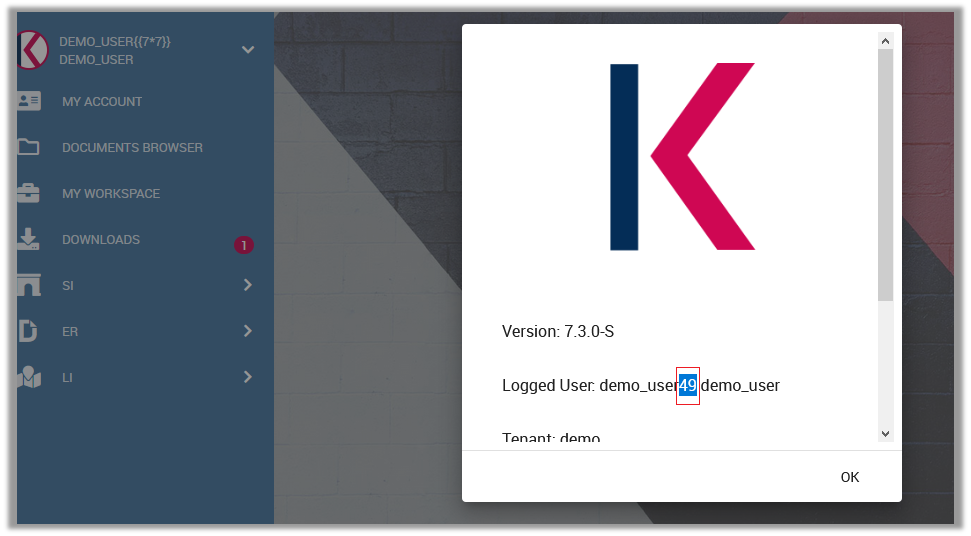

# CVE-2021-30214: Knowage Suite 7.3 is vulnerable to Stored Client-Side Template Injection in '/knowage/restful-services/signup/update' via the 'name' parameter.

### Overview

Knowage ([https://www.knowage-suite.com](https://www.knowage-suite.com)) is the Open Source Business Analytics Suite combining traditional and big data sources into valuable and meaningful information.

### Description
The vulnerability is present in the '**/knowage/restful-services/signup/update**', and can be exploited throuth a POST request via the '**name**' parameter.
  
### Impact
Client-side template injection vulnerabilities occur when applications using a client-side template dynamically embed user input into web pages in an insecure manner. When a web page is rendered, the framework will scan the page and execute any expressions it encounters. A malicious user can exploit this problem by providing the template with a malicious expression that launches an XSS (Cross-Site Scripting) attack, for example. Users can be tricked into sending the attacker's prearranged request in various ways. For instance, the attacker may send a link containing a malicious URL to a victim in an e-mail or instant message. 
Client-side templates often implement a sandbox to prevent the direct execution of arbitrary JavaScript from within an expression. However, sandboxes can be bypassed.
The security impact depends on the nature of the vulnerable application, the types of data and functionality it contains, and the other applications that belong to the same domain and organisation. 

### Timeline
- **2021-02-09**: Discovered and reported to [Knowage](https://www.knowage-suite.com)
- **2021-02-09**: Got instant response from Knowage development team, "Thanks for your analysis report. We will evaluate your finding and get back to you soon with our feedback.
- **2021-03-22**: Knowage Team fixed this issue in Knowage version 7.4.0
- **2021-05-13**: I have obtained the [CVE-2021-30214](https://nvd.nist.gov/vuln/detail/CVE-2021-30214) and published the PoC

### Discovered by

#### [Gianluca Palma](https://www.linkedin.com/in/piuppi/) ([@piuppi](https://twitter.com/piuppi)) of [Engineering Ingegneria Informatica S.p.A.](https://www.eng.it)
#### [Antonio Scibilia](https://www.linkedin.com/in/nynuz/) of [Cybertech S.r.l.](https://cybertech.eu)

### Proof of concept (POC)
#### Reproducing Steps

In the main menu you can open the "My Account" menu, where the "**name**" field is vulnerable to client side template injection stored, in fact entering the mathematical expression **{{7*7}}** this is stored and processed by the **Angular template** as an arithmetic expression when requesting the user's "**info menu"**, displaying the result (49) in the "**Logged User**" field below:

##### Request:

##### Info menu:

##### Response:

### Suggestions

If possible, avoid using server-side code to dynamically embed user input in client-side templates. If this is not possible, consider filtering user input before embedding it in the template. Note that HTML coding is not sufficient to prevent these attacks, because templates perform HTML decoding of the relevant content before detecting and executing expressions.
