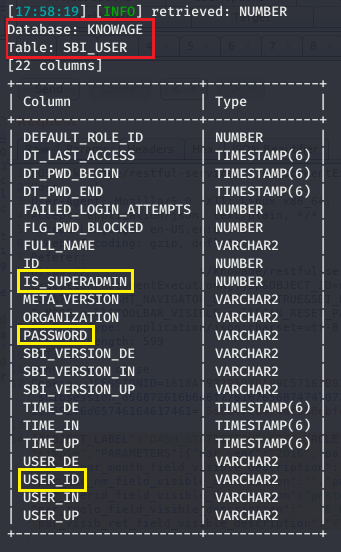

# CVE-2021-30055 : A SQL injection vulnerability in Knowage Suite version 7.1 exists in the documentexecution/url analytics driver component via the 'par_year' parameter when running a report.

### Overview
Knowage ([https://www.knowage-suite.com](https://www.knowage-suite.com)) is the Open Source Business Analytics Suite combining traditional and big data sources into valuable and meaningful information.

### Description
The SQLi vulnerability in the **'documentexecution'** component can be exploited via the '**par_year**' parameter, using an SQL payload to trigger a **'boolean-based blind'** injection.

### Impact
This vulnerability allows attackers with limited privileges to execute arbitrary SQL commands on the database server, exfiltrate sensitive data and perform privilege escalation by gaining access as a superadmin.

### Timeline
- **2021-02-09**: Discovered and reported to [Knowage](https://www.knowage-suite.com)
- **2021-02-09**: Got instant response from Knowage development team, "Thanks for your analysis report. We will evaluate your finding and get back to you soon with our feedback."
- **2021-03-22**: Knowage Team fixed this issue in Knowage version 7.4.0
- **2021-04-05**: I have obtained the [CVE-2021-30055](https://nvd.nist.gov/vuln/detail/CVE-2021-30055) and published the PoC

### Discovered by

#### [Gianluca Palma](https://www.linkedin.com/in/piuppi/) ([@piuppi](https://twitter.com/piuppi)) of [Engineering Ingegneria Informatica S.p.A.](https://www.eng.it)
#### [Antonio Scibilia](https://www.linkedin.com/in/nynuz/) of [Cybertech S.r.l.](https://cybertech.eu)

### Proof of concept (POC)
#### Reproducing Steps

After logging into the **Knowage** application with an unprivileged user, it was possible to call any available Cockpit document and run the corresponding report.

Sending the report execution, filtered by year, generates a POST request that invokes the **'documentexecution/url'** method where in this specific case the **"par_year "** parameter is not properly sanitised and allows the SQL code to be embedded and executed in the query.

##### Request:

if the bolean condition is **true**, the application generates an error code (no. 1077) relating to the analytical driver used by the 'cockpit' document

##### Response:

while in the case of a **false** condition, a generic validation message is generated for the parameter.
##### Response:

Once the correct payload was found, it was possible to exfiltrate various sensitive contents from the back-end database, including the **password hashes of Knowage users**, below:

##### SBI_USER table enumeration

##### Passwords hash

 

After retrieving the hashes of the users, we analysed the source code available **[here](https://github.com/KnowageLabs/Knowage-Server/blob/master/cas/src/main/java/it/eng/spagobi/authentication/handler/AsymmetricProviderSingleton.java)** relating to the mechanism for storing user passwords in the database, and it emerged that the hashes are of type **HMAC-SHA1** and the **secret** is hard-coded in the **AsymmetricProviderSingleton.java** file.

So, it was possible to write a dictionary-based decryptor in Python that allowed us to retrieve the password of the **biadmin** user (SUPERADMIN) in clear text:

and we were finally able to access the web application as biadmin (SUPERADMIN user):

### Suggestions

The most effective way to prevent SQL injection attacks is to use parameterized queries (also known as prepared statements) for all database access. This method uses two steps to incorporate potentially tainted data into SQL queries: first, the application specifies the structure of the query, leaving placeholders for each item of user input; second, the application specifies the contents of each placeholder. Because the structure of the query has already been defined in the first step, it is not possible for malformed data in the second step to interfere with the query structure. You should review the documentation for your database and application platform to determine the appropriate APIs which you can use to perform parameterized queries. It is strongly recommended that you parameterize every variable data item that is incorporated into database queries, even if it is not obviously tainted, to prevent oversights occurring and avoid vulnerabilities being introduced by changes elsewhere within the code base of the application.

You should be aware that some commonly employed and recommended mitigations for SQL injection vulnerabilities are not always effective:

- One common defense is to double up any single quotation marks appearing within user input before incorporating that input into a SQL query. This defense is designed to prevent malformed data from terminating the string into which it is inserted. However, if the data being incorporated into queries is numeric, then the defense may fail, because numeric data may not be encapsulated within quotes, in which case only a space is required to break out of the data context and interfere with the query. Further, in second-order SQL injection attacks, data that has been safely escaped when initially inserted into the database is subsequently read from the database and then passed back to it again. Quotation marks that have been doubled up initially will return to their original form when the data is reused, allowing the defense to be bypassed.

- Another often cited defense is to use stored procedures for database access. While stored procedures can provide security benefits, they are not guaranteed to prevent SQL injection attacks. The same kinds of vulnerabilities that arise within standard dynamic SQL queries can arise if any SQL is dynamically constructed within stored procedures. Further, even if the procedure is sound, SQL injection can arise if the procedure is invoked in an unsafe manner using user-controllable data.

