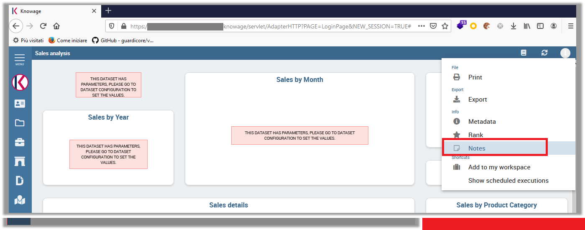
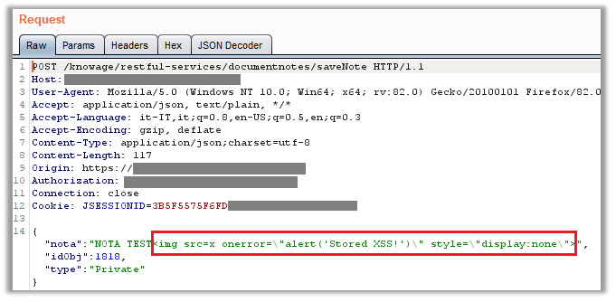
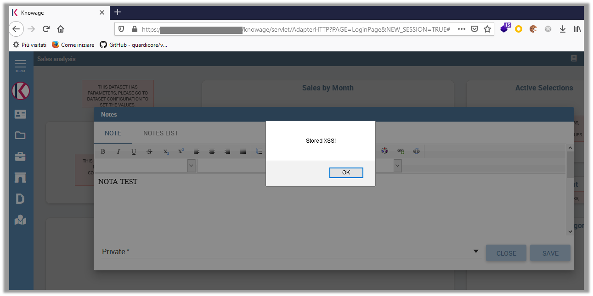

# Knowage Suite 7.3 is vulnerable to Stored Cross-Site Scripting (XSS). An attacker can inject arbitrary web script in '/knowage/restful-services/documentnotes/saveNote' via the 'nota' parameter.

### Overview

Knowage ([https://www.knowage-suite.com](https://www.knowage-suite.com)) is the Open Source Business Analytics Suite combining traditional and big data sources into valuable and meaningful information.

### Description
The vulnerability is present in the '**/knowage/restful-services/documentnotes/saveNote**', and can be exploited throuth a POST request via the '**NOTA**' parameter.

### Impact
An attacker can send Javascript code through any vulnerable form field to change the design of the website or any information displayed to the user, saving the information persistently on the site (e.g. database). As a result, the user will see the data sent by the attacker every time he calls up the vulnerable page.

### Timeline
- **2021-02-12**: Discovered and reported to [Knowage](https://www.knowage-suite.com)
- **2021-02-12**: Got instant response from Knowage development team, "Thanks for your analysis report. We will evaluate your finding and get back to you soon with our feedback.
- **2021-03-22**: Knowage Team fixed this issue in Knowage version 7.4.0

### Discovered by

#### [Gianluca Palma](https://www.linkedin.com/in/piuppi/) ([@piuppi](https://twitter.com/piuppi)) of [Engineering Ingegneria Informatica S.p.A.](https://www.eng.it)
#### [Antonio Scibilia](https://www.linkedin.com/in/nynuz/) of [Cybertech S.r.l.](https://cybertech.eu)

### Proof of concept (POC)
#### Reproducing Steps

After logging into the **Knowage Suite** portal with an any profile, you can navigate to any 'cockpit' document and add a notes from the contextual menu in the top right-hand corner:

By intercepting the POST request, an XSS payload can be added to the '**nota**' field and, as can be seen from the following evidence, the content of the injection was correctly saved on the page (**on the database**) and executed each time the note in question was opened.

##### Request:

##### Response:

### Suggestions

In most situations where user-controllable data is copied into application responses, HTML Injection attacks can be prevented using two layers of defenses:
- Input should be validated as strictly as possible on arrival, given the kind of content that it is expected to contain. For example, personal names should consist of alphabetical and a small range of typographical characters, and be relatively short; a year of birth should consist of exactly four numerals; email addresses should match a well-defined regular expression. Input which fails the validation should be rejected, not sanitized.
- User input should be HTML-encoded at any point where it is copied into application responses. All HTML metacharacters, including < > " ' and =, should be replaced with the corresponding HTML entities (&lt; &gt; etc).
In cases where the application's functionality allows users to author content using a restricted subset of HTML tags and attributes (for example, blog comments which allow limited formatting and linking), it is necessary to parse the supplied HTML to validate that it does not use any dangerous syntax; this is a non-trivial task.
