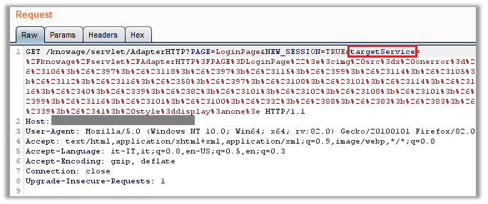
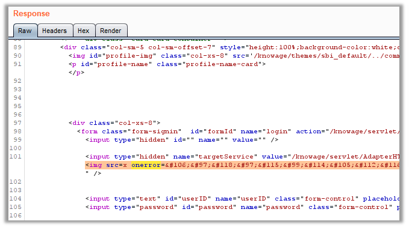
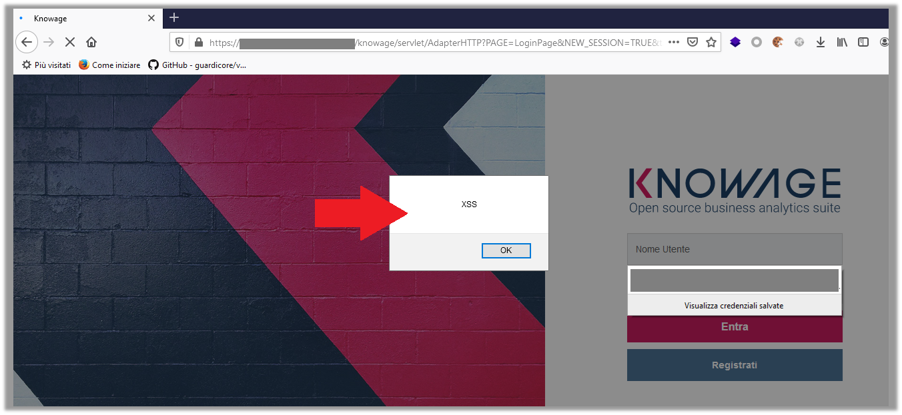

# CVE-2021-30213: Knowage Suite 7.3 is vulnerable to unauthenticated reflected cross-site scripting (XSS). An attacker can inject arbitrary web script in '/servlet/AdapterHTTP' via the 'targetService' parameter.

### Overview

Knowage ([https://www.knowage-suite.com](https://www.knowage-suite.com)) is the Open Source Business Analytics Suite combining traditional and big data sources into valuable and meaningful information.

### Description
The vulnerability is present in the '**/servlet/AdapterHTTP**', and can be exploited throuth a GET request via the '**targetService**' parameter.
  
### Impact
An attacker can use the vulnerability to construct a request that, if issued by another application user, will cause JavaScript code supplied by the attacker to be executed within his browser in his session context of the application. The attacker-supplied code can perform a wide variety of actions, such as performing arbitrary actions on victim's behalf, and logging their keystrokes. Users can be induced to initiate the attacker's crafted request in various ways. For example, the attacker could send a victim a link containing a malicious URL via email or instant message.

### Timeline
- **2021-02-09**: Discovered and reported to [Knowage](https://www.knowage-suite.com)
- **2021-02-09**: Got instant response from Knowage development team, "Thanks for your analysis report. We will evaluate your finding and get back to you soon with our feedback.
- **2021-03-22**: Knowage Team fixed this issue in Knowage version 7.4.0
- **2021-05-13**: I have obtained the [CVE-2021-30213](https://nvd.nist.gov/vuln/detail/CVE-2021-30213) and published the PoC
### Discovered by

#### [Gianluca Palma](https://www.linkedin.com/in/piuppi/) ([@piuppi](https://twitter.com/piuppi)) of [Engineering Ingegneria Informatica S.p.A.](https://www.eng.it)
#### [Antonio Scibilia](https://www.linkedin.com/in/nynuz/) of [Cybertech S.r.l.](https://cybertech.eu)

### Proof of concept (POC)
#### Reproducing Steps

On the main login page of the Knowage 7.3 portal, an XSS vulnerability was identified that was reflected in the HTML DOM page before authentication, via the GET 'targetService' parameter:

##### Request:

##### HTML Response:

##### Response:

### Suggestions

In most situations where user-controllable data is copied into application responses, cross-site scripting attacks can be prevented using two layers of defenses:
- Input should be validated as strictly as possible on arrival, given the kind of content that it is expected to contain. For example, personal names should consist of alphabetical and a small range of typographical characters, and be relatively short; a year of birth should consist of exactly four numerals; email addresses should match a well-defined regular expression. Input which fails the validation should be rejected, not sanitized.
- User input should be HTML-encoded at any point where it is copied into application responses. All HTML metacharacters, including < > " ' and =, should be replaced with the corresponding HTML entities (&lt; &gt; etc).
In cases where the application's functionality allows users to author content using a restricted subset of HTML tags and attributes (for example, blog comments which allow limited formatting and linking), it is necessary to parse the supplied HTML to validate that it does not use any dangerous syntax; this is a non-trivial task.
