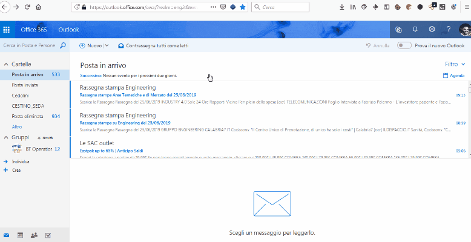
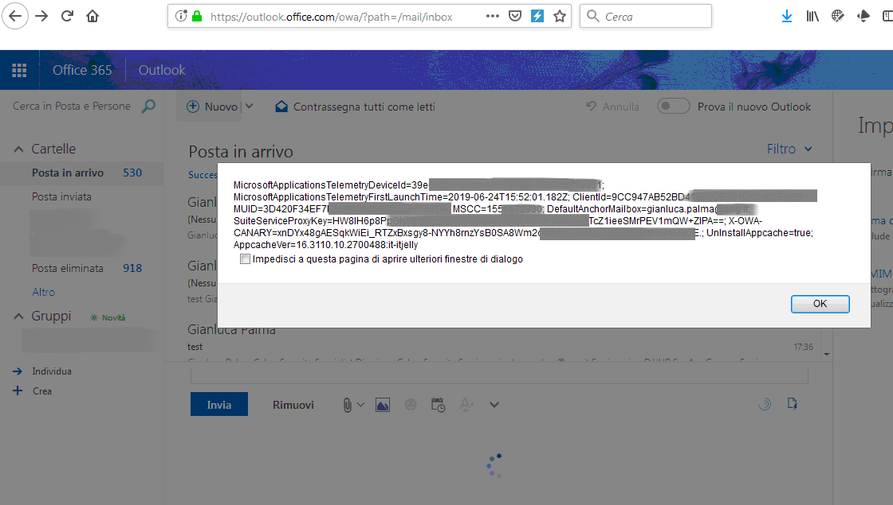

# Vulnerabilities discovered in Microsoft Office365 Outlook Web Access (https://outlook.office.com/owa)

### Overview
Outlook Web Access is a personal information manager web app from Microsoft. It is included in Microsoft 365, Office 365, Exchange Server 2016/2019, and Exchange Online. It includes a web-based email client, a calendar tool, a contact manager, and a task manager.

### Discovered by
#### [Gianluca Palma](https://www.linkedin.com/in/piuppi/) ([@piuppi](https://twitter.com/piuppi)) of [Engineering Ingegneria Informatica S.p.A.](https://www.eng.it)
 
### Description

#### A Stored cross-site scripting (XSS) vulnerability in Microsoft Office365 OWA, which allows remote attackers to inject arbitrary HTML or web scripts by creating an ad-hoc email signature containing a malicious link, which can lead to data leakage. XSS is executed whenever a new email message is created, however running a logoff and logon no longer triggers it.

Stored cross-site scripting vulnerabilities arise when user input is stored and later embedded into the application's responses in an unsafe way. An attacker can use the vulnerability to inject malicious JavaScript code into the application, which will execute within the browser of any user who views the relevant application content. The attacker-supplied code can perform a wide variety of actions, such as stealing victims' session tokens or login credentials, performing arbitrary actions on their behalf, and logging their keystrokes. Methods for introducing malicious content include any function where request parameters or headers are processed and stored by the application, and any out-of-band channel whereby data can be introduced into the application's processing space (for example, email messages sent over SMTP that are ultimately rendered within a web mail application). Stored cross-site scripting flaws are typically more serious than reflected vulnerabilities because they do not require a separate delivery mechanism in order to reach target users, and are not hindered by web browsers' XSS filters. Depending on the affected page, ordinary users may be exploited during normal use of the application. In some situations this can be used to create web application worms that spread exponentially and ultimately exploit all active users.

### Proof of concept (POC)
#### Reproducing Steps



##### Document cookie: 


##### Used payload:
```"></a></div><svg/onload=alert(String.fromCharCode(88,83,83))><!--```
    
```<%<!--'%><script>alert(document.cookie);</script -->```

### Timeline
- **2019-06-25**: Discovered and reported to Microsoft
- **2019-06-25**: Got instant response from Microsoft Security Response Center, "Thank you for contacting the Microsoft Security Response Center (MSRC). Your report has been received and you should receive a follow-up message from the case manager once your case has been fully reviewed."
- **2019-06-26**: Got mail saying, "Thank you very much for your report.I have opened case '{redacted}' and the case manager, '{redacted}' will be in touch when there is more information."
- **2019-06-27**: Got mail saying, "Just a quick introduction, I'm the MSRC case manager who will be looking after this investigation moving forward. Thank you for reporting this to Microsoft responsibly - we appreciate your effort in doing so. At this moment the product team is investigating your report and I hope to have some feedback fairly soon."
- **2019-07-12**: Got mail saying, "We have successfully reproduced the issue that you reported to us.  We will be finishing our investigation and determining if we will address it in a security release."
- **2019-08-02**: Got mail saying, "We're happy to inform you that your case {redacted} is eligible for a $500 bounty award. Congratulations and thank you for your continued support in helping to secure some of the world's largest platforms, products, and services."
- **2019-09-09**: Got mail saying, "A fix has been confirmed for the issue you reported, We have resolved the issue you reported, and have closed this case."
