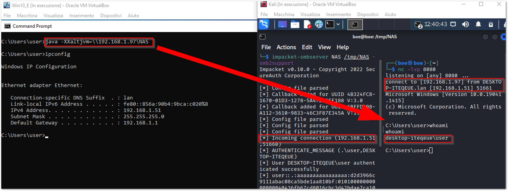

# Java parameter "-XXaltjvm" allows arbitrary JVM.dll loading from a desired SMB path

Java.exe and javaw.exe support an undocumented hidden command-line parameter "-XXaltjvm" and also "-J-XXaltjvm." This parameter instructs Java to load an alternative JavaVM library (jvm.dll or libjvm.so) from the desired SMB path.

The DLL is then loaded into memory without writing to the filesystem. This can be used to load a malicious DLL and execute arbitrary code on the system, evading AV defenses in many cases, since it has no explicit reference to the malicious activity in the command line; obviously, the shellcode must be properly obfuscated. Use in restrictive environments where other binaries cannot be executed (e.g., Citrix environments, SRP policies, etc.).

## Tested on Windows 10 and JRE ver. 11.0.14

Reference: [https://seclists.org/bugtraq/2010/Apr/80](https://seclists.org/bugtraq/2010/Apr/80)

## PoC

..still works in 2022
