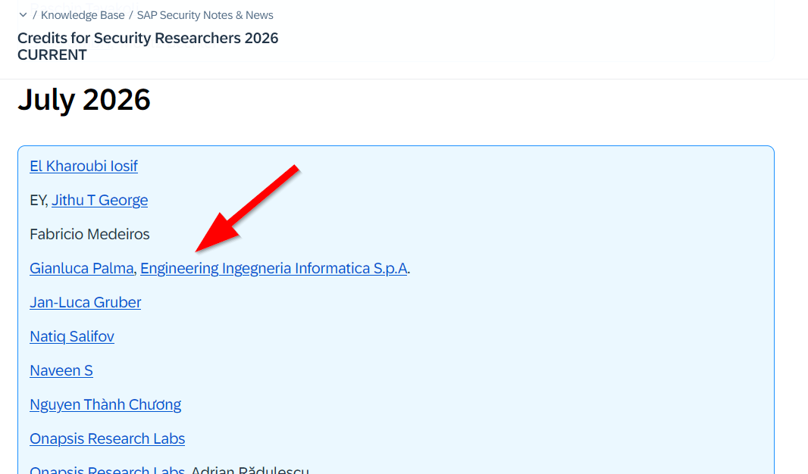

# SAProuter DLL Hijacking (CVE-2026-0487)

## Overview

This repository documents **CVE-2026-0487**, a DLL Hijacking vulnerability affecting SAProuter on Microsoft Windows.

The vulnerability allows an unauthenticated attacker to load library (DLL) files from an untrusted location, potentially hijacking the DLL loading process and achieving arbitrary code execution.

The issue was responsibly disclosed to SAP through a coordinated vulnerability disclosure process and was addressed in the **July 2026 SAP Security Patch Day**.

## Vulnerability Details

SAProuter on Microsoft Windows allows an unauthenticated attacker to load library (DLL) files from an untrusted location, allowing them to execute malicious code on the system.

This could enable the attacker to hijack the DLL loading process and achieve arbitrary code execution. This has high impact on confidentiality, integrity and availability of the system.

## Technical Background

The vulnerability belongs to the DLL Hijacking vulnerability class, caused by an uncontrolled search path element (CWE-427).

Because SAProuter is a digitally signed SAP executable, insecure DLL loading behavior may increase the risk of abuse in post-compromise scenarios where attackers attempt to leverage trusted software components.

## Impact

Successful exploitation may allow:
- Arbitrary code execution
- Compromise of confidentiality, integrity, and availability of the affected system

## Affected Versions

The vulnerability affects **SAProuter on Microsoft Windows**.

| Component | Versions |
|---|---|
| SAProuter / Kernel Components | KRNL64NUC 7.22, 7.22EXT |
| SAProuter / Kernel Components | KRNL64UC 7.22, 7.22EXT |
| SAP_ROUTER | 7.53 |
| KERNEL | 7.22, 7.53, 7.54 |
| SAProuter | 7.53, 7.54, 7.77, 7.89, 7.93, 9.16, 9.17, 9.18 |

## Proof of Concept

For responsible disclosure reasons, this repository does not include exploit code, malicious DLL files, or weaponized payloads.

The proof of concept was privately shared with SAP during the coordinated vulnerability disclosure process.

## Remediation

SAP addressed this vulnerability through [SAP Security Note 3692165](https://me.sap.com/notes/3692165), released as part of the July 2026 SAP Security Patch Day.

## Credits

Discovered and responsibly disclosed by:

[Gianluca Palma](https://www.linkedin.com/in/piuppi/) ([@piuppi](https://twitter.com/piuppi)) of [Engineering Ingegneria Informatica S.p.A.](https://www.eng.it)

## References

- CVE-2026-0487:
  https://www.cve.org/CVERecord?id=CVE-2026-0487

- SAP Security Patch Day - July 2026:
  https://support.sap.com/en/my-support/knowledge-base/security-notes-news/july-2026.html

- SAP Security Hall of Fame:
  https://support.sap.com/en/my-support/knowledge-base/security-notes-news/credits-for-security-researchers.html?anchorId=M6

# Disclosure Timeline

| Date | Event |
|---|---|
| 2025 | Vulnerability discovered during security research activities |
| 2025 | Vulnerability reported to SAP Security Response Team through coordinated disclosure |
| 2025 - 2026 | Technical analysis, validation and remediation discussions with SAP |
| July 2026 | SAP Security Note 3692165 released as part of SAP Security Patch Day |
| July 2026 | CVE-2026-0487 publicly disclosed |
| July 2026 | Researcher credited in SAP Security Hall of Fame |

> The vulnerability was handled through SAP's coordinated vulnerability disclosure process.

---

## Disclaimer

This repository is intended for educational and defensive security research purposes only.

No exploit code or malicious binaries are distributed.
