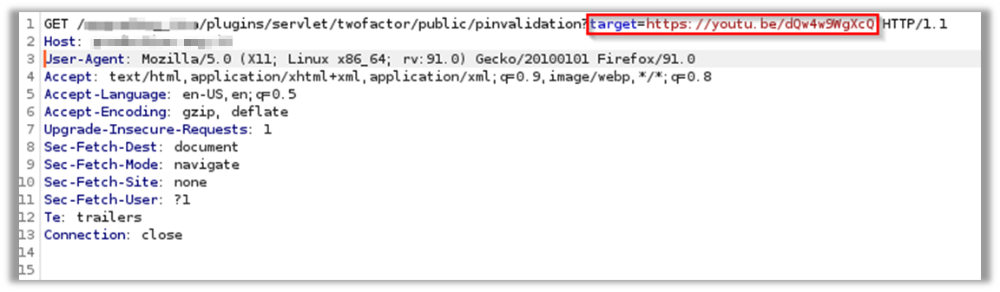
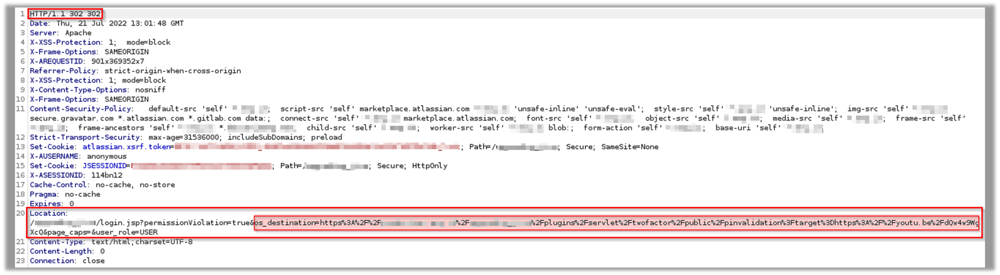
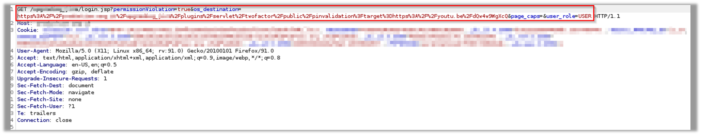
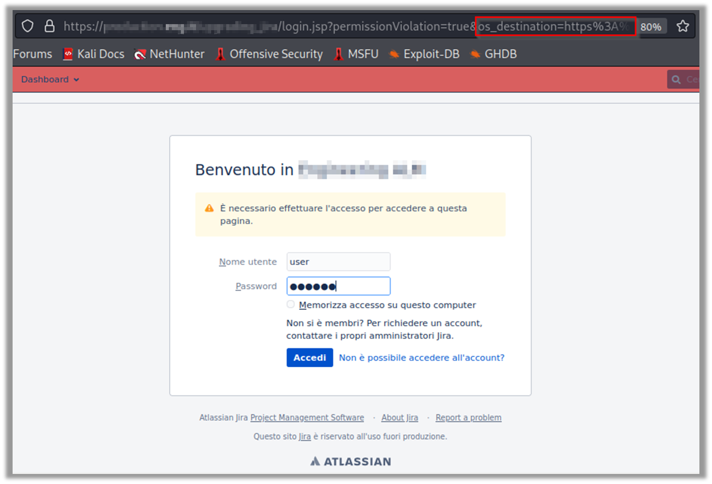
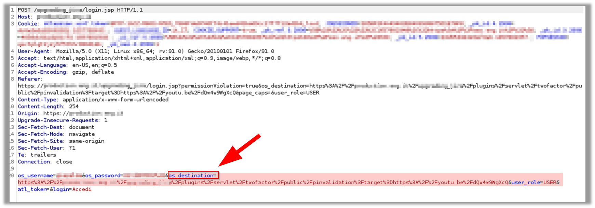
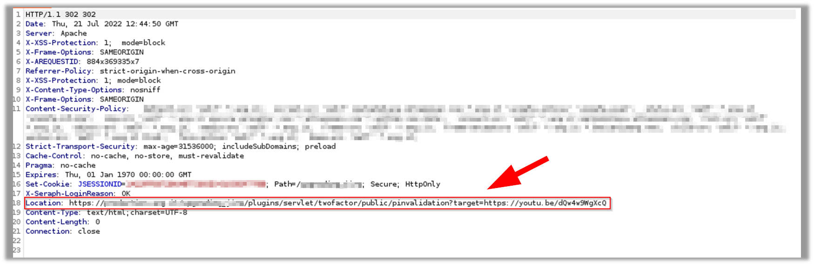
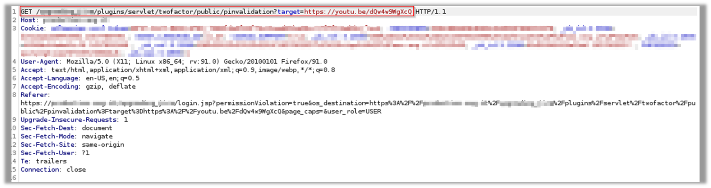
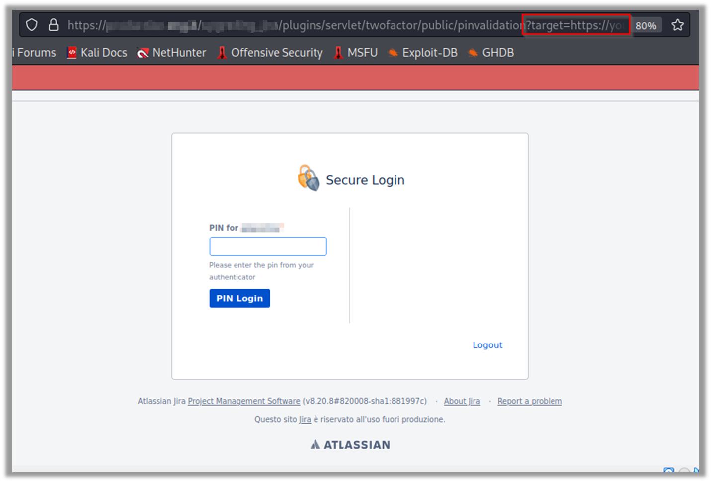
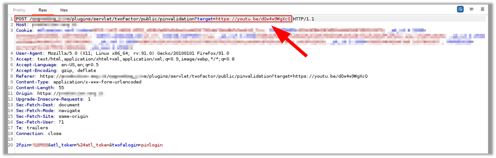
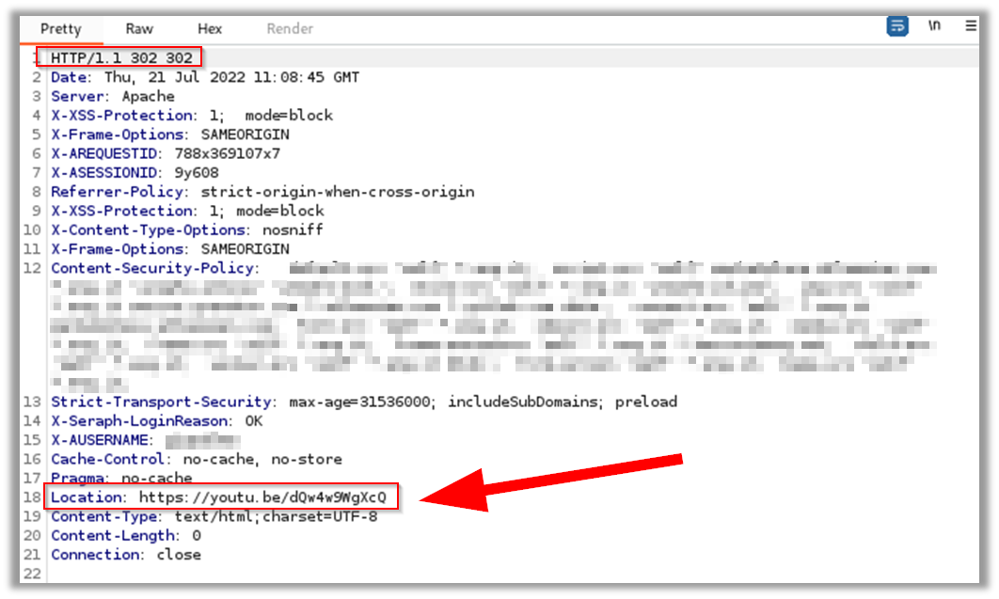

# The 'Secure Login (2FA) for Jira' plugin prior to version 3.1.1.0 is vulnerable to Open Redirect which would allow an attacker to redirect users to a website under his control, opening them up to a phishing attack (https://marketplace.atlassian.com/apps/1213472/secure-login-2fa-jira).

### Overview
**'Secure Login (2FA)'** is a Two-factor authentication (2FA) Plugin for Atlassian Tools developed by [Syracom AG](https://www.syracom.de), an independent business and IT consulting firm that is a [Atlassian](https://www.atlassian.com) Silver Solution Partner, where it focuses on designing efficient and durable business processes based on Atlassian tools.

Plugin available on Atlassian marketplace here: https://marketplace.atlassian.com/apps/1213472/secure-login-2fa-jira

### Vulnerability Description
#### Prior to version 3.1.1.0 of the Secure Login for Jira Plugin, the PIN validation page contains an 'Open Redirect' that would allow an attacker to redirect users to a website under his control, opening them up to a phishing attack.

An open redirect vulnerability is a type of security vulnerability that occurs when a web application allows users to be redirected to a URL of the attacker's choice. This can happen if the application does not properly validate the target of a redirect.
If the application does not properly validate the redirect URL, an attacker could craft a link that, when clicked, logs the user into the application and then redirects them to a malicious site.

### Impacts
The impacts of an open redirect vulnerability depend on how it is exploited and the attacker's goals. In general, the possible impacts of this type of vulnerability may include:

- Stealing the user's login credentials: an attacker may exploit an open redirect vulnerability to trick users into logging into a fake site, which could then steal their login credentials.
- Inducing the user to reveal sensitive information: an attacker could create a link that redirects users to a site that asks them to enter sensitive information.
- Exploiting the credibility of a legitimate site: an attacker may exploit an open redirect vulnerability to redirect users to a malicious site that may be difficult to distinguish from a legitimate site. In this way, users may be tricked into divulging sensitive information.

### Timeline
- **2022-07-21**: Discovered and reported to Atlassian Security Team.
- **2022-07-22**: In the meantime, I also opened a ticket to the plugin developer Syracom AG
- **2022-07-22**: I added details to the Syracom ticket with a PoC in PDF format that I had also sent to Atlassian.
- **2022-07-24**: Got mail from Syracom saying, _"Hello Gianluca, thank you very much for providing us with this security information. We already have access to all the information you provided to Atlassian. The next step for us is to check the functionality. Thanks for the detailed information! Best regards"._
- **2022-07-25**: Got mail from Atlassian Security Team saying, _"Hi Gianluca Palma, We have also provided details to the developer of the plugin. Thank you for doing likewise. In case it helps our communication with the vendor is occurring via a ticket with an identifier of "AMS-*****". As this issue is not in Atlassian component we are now going to close this issue. Thank you for sending this notification to Atlassian"._
- **2022-08-23**: I sent a reminder, _"Hi Team, is there any news about this vulnerability? have you been able to reproduce it? I remain available for any clarification. Thanks and Regards, Gianluca"._
- **2022-08-23**: Got mail saying, _"Hello Gianluca, we were able to analyze the issue. Now we are working on a fix. Thanks for asking. Best regards"._
- **2022-09-20**: I sent a reminder, _"Hi Team, I would like to know if there is any good news about the fix of this issue. Thank you in advance and have a nice day. Regards, Gianluca"._
- **2022-09-21**: Got mail saying, _"Hello Gianluca, thanks for asking. We found a solution and we are now testing the Fix. This causes time because we want to be very sure that everything works as designed. Have an amazing day"._
- **2022-11-11**: I sent a reminder, _"Hi Team, is there any news about this open redirect vulnerability? Have a nice day. Thanks and Regards, Gianluca"._
- **2022-11-11**: Got mail saying, _"Hello Gianluca, we fixed the problem and the security ticket of Atlassian is in the status “patched”. We released the fix with version 3.1.1.0 on 26th October on the  Atlassian Marketplace. We want to thank you very much for informing us about the bug and for the excellent description of the bug. It helped us a lot to find the bug. Please excuse the late return. Best regards"._
- **2022-11-11**: I immediately replied, _"Hi Team, thank you very much for this information. Would it be possible for you to include this vulnerability in a your public security advisory where you mention me as a security researcher who helped you address and fix this vulnerability? Thanks"._
- **2022-11-16**: I sent a reminder, _"Hi Team, could you please support me with my last request to create a Security advisory for this vulnerability on your portal? I would like to request CVE to MITRE, but without your public advisory I would have to publish a full disclosure of the vulnerability on my github with a PoC. Thanks and Regards, Gianluca"._
- **2022-11-16**: Got mail saying, _"Hi, I did not forget your request, but we are a little busy. I will check that and come back to you. Best regards"._
- **2022-12-07**: I sent a reminder, _"Hi Team, I would like to know if I can proceed with the CVE request to MITRE, and if you could then kindly publish the security advisory on your site as I had requested"._
- **2022-12-19**: Since November 16 I have not received a response, so I sent my decision, _"Hi Team, in the meantime it has been more than a month since you fixed the vulnerability. I understand that you are busy, which is why I thought your security advisory was not necessary, so I will send the CVE request to MITRE and publish a POC on my github account. Thank you and Best Regard, Gianluca"._
- **2023-01-10**: I waited a few more days before publishing the poc today, hoping to get a response on the requested Security Advisory (_which I did not receive_).
- **2023-01-10**: I requested the CVE to MITRE

### Discovered by

#### [Gianluca Palma](https://www.linkedin.com/in/piuppi/) ([@piuppi](https://twitter.com/piuppi)) of [Engineering Ingegneria Informatica S.p.A.](https://www.eng.it)

### Proof of concept (POC)
#### Reproducing Steps

Here are the steps to reproduce it, with the relevant evidence:

- ##### The attacker can craft a malicious URL that points to the 2FA PIN validation page, below:

`https://WWW.YOUR-JIRA-PORTAL.ORG/plugins/servlet/twofactor/public/pinvalidation?target=https://youtu.be/dQw4w9WgXcQ`

as can be seen, there is a **'target'** parameter in the query string that points to the phishing site used by the attacker to steal credentials; a rickrolling link was used for this PoC.

- ##### Note that the victim user, at this stage is not yet authenticated on the JIRA portal, so they click on the link:

the application performs a redirect to **'login.jsp'** page by setting the GET parameter **'os_destination'** that contains the full link sent by the attacker:

the redirect is performed:

as can be seen above, the user has not yet logged in, but the content of the GET parameter **'os_destination'** returns the malicious link initially sent by the attacker.

- ##### At this point, the victim user enters his credentials to log in:

Again, as can be seen below, the login request this time sends a **POST request** always containing the parameter **"os_destination"** with the malicious link sent by the attacker:

Then the application authenticates the user and performs a **redirect (302)** to the 2FA **pinvalidation** page, sending in the query string the vulnerable parameter **'target'** specified by the attacker :

the redirect is performed:

- ##### at this stage the **secure Login 2FA plugin** asks the victim user to open the Authenticator app on their mobile device and enter the **OTP PIN** received, below:

Next, the PIN is sent via a POST request, where, however, the vulnerable parameter **'target'** is again transmitted in GET:

Finally, the application performs the reindirect (302) to the URL established by the attacker, which, for example, could faithfully reproduce the **JIRA login phishing page with an unexpected validation error related to the PIN code entered**, causing the victim user to re-enter their credentials and PIN by capturing both (_replay attack_):

But this PoC I used a Rick-rolling page :relaxed:

### Suggestions
To mitigate the open redirection vulnerability, it is important for web application developers to properly validate redirection URLs. There are several techniques that can be used for this purpose:
- Validate redirect URLs within the same domain: developers can configure the application to only allow redirects to URLs within the same domain.
- Validate redirect URLs using a list of allowed URLs: developers can maintain a list of URLs that are allowed for redirects and validate redirect URLs based on this list.
- Validate redirect URLs using a URL validation library: several libraries are available for validating redirect URLs, such as the "validator" library in Node.js.
- Manually validate redirect URLs: developers can manually validate redirect URLs using the appropriate method for their specific web application.

Additionally, developers should avoid using query or fragment parameters to specify redirect URLs, as these can be easily modified by the attacker. Instead, they should use a more secure method such as form hidden fields to specify redirect URLs.
