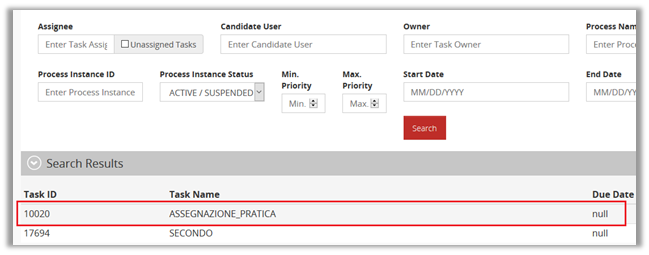
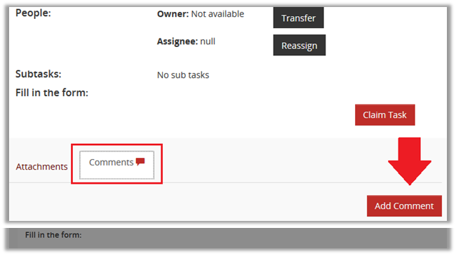

# WSO2 Enterprise Integrator version 6.6.0 and earlier is vulnerable to Stored Cross-Site-Scripting (XSS) in BPMN explorer (https://www.wso2.com)

### Overview
WSO2 Enterprise Integrator (WSO2 EI) is an open-source hybrid integration platform providing graphical and CLI tooling, integration runtimes, and monitoring with a variety of deployment options.

### Description
#### In BPMN explorer when comments are added to tasks, an attacker can replace the request with an XSS payload. Then XSS payload gets stored and executed every time the user loads the task. The bug is present in 'components/bpmn/bpmn-explorer-web/src/web/template/taskView.jag' and resides in the lack of sanitation of the 'message' parameter.

Stored cross-site scripting vulnerabilities arise when user input is stored and later embedded into the application's responses in an unsafe way. An attacker can use the vulnerability to inject malicious JavaScript code into the application, which will execute within the browser of any user who views the relevant application content.
The attacker-supplied code can perform a wide variety of actions, such as stealing victims' session tokens or login credentials, performing arbitrary actions on their behalf, and logging their keystrokes.
Methods for introducing malicious content include any function where request parameters or headers are processed and stored by the application, and any out-of-band channel whereby data can be introduced into the application's processing space (for example, email messages sent over SMTP that are ultimately rendered within a web mail application).
Stored cross-site scripting flaws are typically more serious than reflected vulnerabilities because they do not require a separate delivery mechanism in order to reach target users, and are not hindered by web browsers' XSS filters. Depending on the affected page, ordinary users may be exploited during normal use of the application. In some situations this can be used to create web application worms that spread exponentially and ultimately exploit all active users.

### Impact
By leveraging an XSS attack, an attacker can make the browser get redirected to a malicious website, make changes in the UI of the web page, retrieve information from the browser or harm otherwise. However, since all the session related sensitive cookies are set with httpOnly flag and protected, session hijacking or similar attacks would not be possible.

### Timeline
- 2020-05-29: Discovered and reported to WSO2 security team 
- 2020-05-29: Got instant response from WSO2 Security team, "Thank you very much for bringing this to our attention. We will evaluate your findings and get back to you with our feedback"
- 2020-06-10: Got mail saying, "My apologies about the delay in confirmation. The Enterprise Integrator team is currently working on your findings."
- 2020-06-11: Got mail saying, "the team is working on a security fix for the XSS issue."
- 2020-07-07: Got mail saying, "This is to inform the current status of this reported issue. Kindly note that, our product team is working on creating patches."
- 2020-07-22: got mail saying, "Kindly note that we are actively working on this issue and we will update you regarding the customer announcement plan and public announcement plan soon."
-2020-07-31: got mail saying, "This is to inform the current status of this reported issue. Kindly note that, our product team is working on creating patches. Once this is done, we will schedule for the customer announcement and public announcement. We will keep on updating you with the further progress on this"
- 2020-08-11: got mail saying, "Currently we are working on the public announcement for this issue. We will keep you updated with the further progress."
- 2020-09-10: got mail saying, "We hope you are doing well. Kindly note that we have published the Security Advisory [1]
- 2020-09-10: I requested the CVE to MITRE
- 2020-10-29: I have obtained the CVE-2020-25516 and published the PoC

### Discovered by

#### [Gianluca Palma](https://www.linkedin.com/in/piuppi/) of [Engineering Ingegneria Informatica S.p.A.](https://www.eng.it)

Please [refer](https://docs.wso2.com/display/Security/Security+Advisory+WSO2-2020-0781") [1] for WSO2 Security Advisory

**Note:** My name has been listed in their security acknowledgment **https://docs.wso2.com/display/Security/Acknowledgments**

### Proof of concept (POC)
#### Reproducing Steps

Here are the steps to reproduce it, with the relevant evidence:

- ##### 1. Login to the bpmn-explorer application (e.g. https://bpmn.company.org/bpmn-explorer/").
- ##### 2. Go to "SEARCH" menu.
- ##### 3. Search any on "tasks" and click on one of them to open the related details.

- ##### 4. Click on add a comment button, then enter free text and send the request.

- ##### 5. Capture the POST request in a inspector proxy (e.g. burp) and replace it with this XSS payload: 

- ##### 6. Now the XSS payload gets stored and executes whenever the user loads this task.
 
 

### Suggestions
In most situations where user-controllable data is copied into application responses, cross-site scripting attacks can be prevented using two layers of defenses:
- Input should be validated as strictly as possible on arrival, given the kind of content that it is expected to contain. For example, personal names should consist of alphabetical and a small range of typographical characters, and be relatively short; a year of birth should consist of exactly four numerals; email addresses should match a well-defined regular expression. Input which fails the validation should be rejected, not sanitized.
- User input should be HTML-encoded at any point where it is copied into application responses. All HTML metacharacters, including < > " ' and =, should be replaced with the corresponding HTML entities (&lt; &gt; etc).
In cases where the application's functionality allows users to author content using a restricted subset of HTML tags and attributes (for example, blog comments which allow limited formatting and linking), it is necessary to parse the supplied HTML to validate that it does not use any dangerous syntax; this is a non-trivial task.
